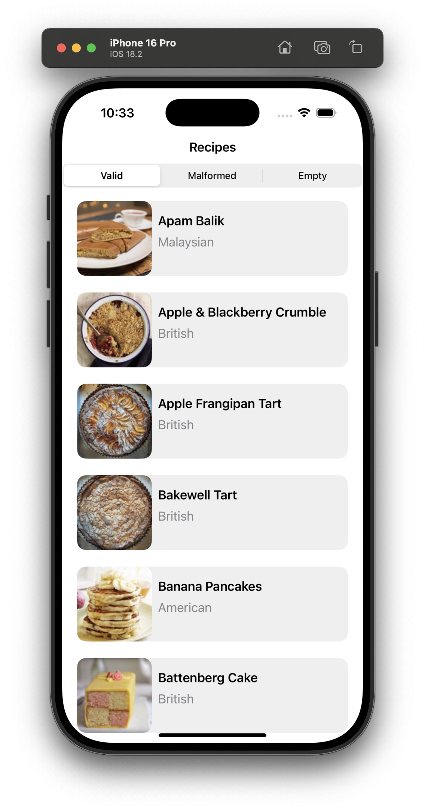
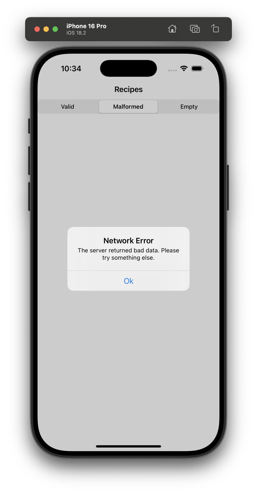
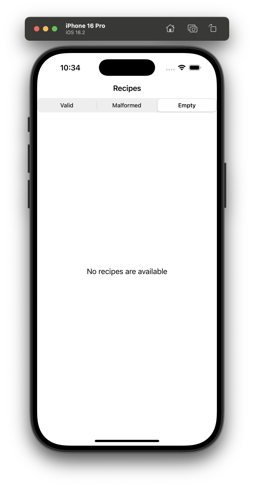
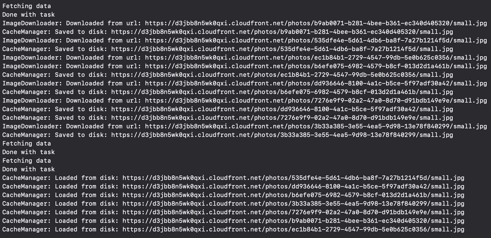

## Recipe App

### Summary: Include screen shots or a video of your app highlighting its features

This app is built with SwiftUI, MVVM and concurrency. Below are examples of the app in action.

| Valid Response                                           | Malformed Response                                           | Empty Response                                           |
| -------------------------------------------------------- | ------------------------------------------------------------ | -------------------------------------------------------- |
|  |  |  |

Below is a screenshot of the logs which captures the apps' ability to cache images. The actions used to generate this log were:

-   Launch the app for the first time
-   Observe the logs to download and cache the images
-   Tap on the "Empty" button in the segmented control
-   Tap on the "Valid" button to load the recipes again
-   Observe the logs to use the images from the cache

However, you could also use the pull-to-refresh feature to produce similar results.

### Focus Areas: What specific areas of the project did you prioritize? Why did you choose to focus on these areas?

I focused on a few different key areas. First, I wanted to emphasize modularity and code reusability. This can be seen in both
the Swift and SwiftUI code.

For the Swift code, I used Swift generics within the network manager to enable reusability for any other decodable API responses.
This enables multiple services to be built on top of this network layer.

I also used dependency injection which enables the code to be tested more easily. Essentially, we can reuse the core components
but inject dependencies that change the underlying behavior. This helps create predictable and more reliable unit tests.

I also leaned heavily into the SOLID design principles. These principles make the code highly adaptable to change while
maintaining the core integrity of the application.

I used the MVVM architectural design pattern which lends itself well to unit testing. This becomes possible by abstracting
the business logic away from the view and into its own testable module.

For SwiftUI, it only makes sense to create reusable views. For example, the segment control has been built using dependency
injection which means that the view doesn't care about the underlying data. Instead, its sole responsibility is to display
the options and notify when an option has been selected.

Another example is the creation of our loading view. This is a view that will be reused over and over again. So, it makes sense
that it should be a single component that can be reused throughout the project.

I chose to focus on these key areas because they demonstrate my ability to create high quality, scalable and maintainable
applications.

### Time Spent: Approximately how long did you spend working on this project? How did you allocate your time?

Overall, I spent a few days on this project on and off. I started initially thinking about the project and planning the pieces
that needed to be built. Then, I decided to mock up the views with SwiftUI while leveraging previews to make adjustments.
Afterwards, I decided that it was time to fetch and connect the data. So, I created the models, view models, and network
services to fulfill the requirements.

As I was creating the view models, I decided that it was also time to add some tests to ensure that the code was resistant to
regressions during subsequent updates. I also thought that this would be a fantastic opportunity to take a deep dive and
really explore Apples' new Swift testing framework. So far, I really like it a lot. With it, I was able to achieve over 90%
code coverage in this project!

### Trade-offs and Decisions: Did you make any significant trade-offs in your approach?

I think the biggest trade-off for me was prioritizing the code quality, scalability, and maintainability over the visual
aesthetics of the application.

### Weakest Part of the Project: What do you think is the weakest part of your project?

The weakest part of my project is definitely the way it looks. I pride myself in developing quality user experiences and, when
paired with great designs, I can develop some pretty cool and unique user experiences. That is an area that could be significantly
improved upon.

### Additional Information: Is there anything else we should know? Feel free to share any insights or constraints you encountered.

I completed this project while typing with only one hand because I dislocated and fractured my elbow a few weeks ago. This is not
an excuse for anything. It is more of a testament that I will always triumph through adversity and can find the silver lining in
any situation.

Last thoughts? I really appreciated this opportunity to showcase my skills and look forward to reviewing it with the team!

Sincerely,

Eric Kasnetsis
